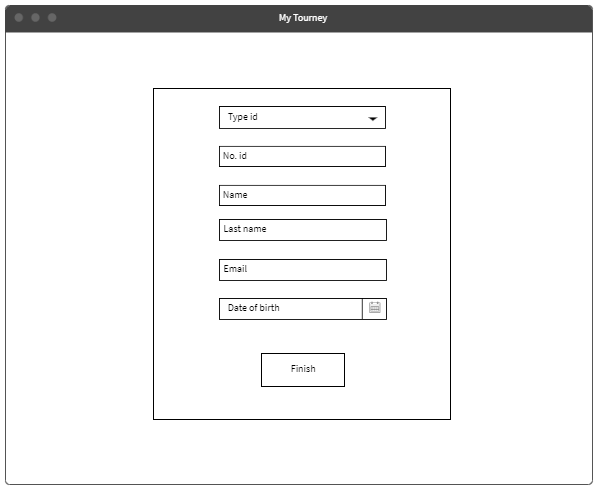

# My-tourney

Integrantes:
* Juan Camilo Angel Hernandez
* Juan Camilo Rojas Ortiz
* Daniel Felipe Walteros Trujillo

### Descripción (antecedentes, problema que se resuelve, etc.):
La idea surge de la necesidad de gestionar campeonatos de futbol en entornos pequeños, 
normalmente en ambientes así se requieren diversas herramientas que lo que hacen es 
complicar más el asunto, actualmente en la Escuela Colombiana de ingeniería Julio Garavito,
 el torneo de sistemas se organiza por medio de diversas herramientas. Pero al desarrollarlo,
  como solo dura un día y hay 20 equipos, la comunicación del estado actual de todos los partidos
   es una actividad muy laboriosa para los jugadores, administradores y espectadores.  

Como solución a esto se proponen dos puntos clave, a la hora de gestionar el torneo,
 realizarlo por medio de una sola aplicación, disminuyendo de esta manera la cantidad
  de errores por las diversas herramientas, y durante el desarrollo del torneo tener una
   plataforma para conocer el estado del partido sin tener que estar vigilando todos los
    juegos al mismo tiempo. 

Adicionalmente, desde que inicia el torneo se tendrán estadísticas del progreso de cada equipo
 (no sé si también de los jugadores) para que los espectadores tengan la oportunidad de escoger
  de mejor forma cual partido van a ver y los equipos puedan medir su rendimiento. 
### Resumen:
My Tourney permitirá a jugadores, árbitros y a espectadores conocer y proporcionar el estado 
de sus propios partidos, pero además permitirá organizarlos de forma interactiva siendo 
mucho más rápida de como se hace tradicionalmente. 
### Historias de usuario:
* Como arbitro quiero notificar algún suceso dentro del partido de forma inmediata para poder dejar claro a todos los participantes (no solo a los espectadores) que ocurrió en el juego. 

* Como administrador quiero organizar las llaves y juegos del torneo de forma más rápida para poder tener más tiempo para administrar los demás recursos del torneo.  

* Como capitán de un equipo quiero registrar la participación de mi equipo para poder participar en el torneo. 

* Como capitán de un equipo quiero modificar la composición de mi equipo cuando ocurran imprevistos para que mi equipo pueda participar en el torneo sin retrasos ni sanciones. 

* Como espectador quiero conocer el estado de otros partidos además del que estoy viendo para poder tener más tiempo viendo los partidos que quiero, en vez de perderlo preguntando qué ha sucedido con los demás partidos. 

* Como jugador quiero conocer el estado de otros partidos para poder saber contra quien me voy a enfrentar sin perder el poco tiempo de descanso que poseo. 

* Como capitán quiero conocer las estadísticas básicas de mi equipo para poder medir el rendimiento y tomar las medidas necesarias. 

* Como jugador quiero conocer las estadísticas de los jugadores para poder conocer mis puntajes, los de mis compañeros y los de mis contrincantes. 

* Como usuario de My Tourney quiero tener un registro en el sistema para poder acceder a las funciones de mi rol. 

### Mockups

#### Vista Home

Logeandose

Registrandose

Selecciona el rol.

Ingresa información adicional.

Apenas ingresa un usuario se encontrará con la siguiente vista donde podrá obsevar el estado de los partidos y loguearse.

Si selecciona un partido podrá ver el resumen en tiempo real.

Tambien podrá ver información de los jugadores.

Tambien podrá ver información de los equipos.

#### Vista Jugador

La siguiente es la vista que se encontrá un jugador.

Si selecciona un partido podrá ver el resumen en tiempo real.

Tambien podrá ver información de los jugadores.

Tambien podrá ver información de los equipos.

Además podrá ver información de su equipo.

#### Vista Capitan

Si ingresa un capitan podrá crear un equipo.

Tambien podrá eliminar y añadir un jugador.

Además podrá ver estadisticas de su equipo.

#### Vista Arbitro

Si ingresa un arbitro podrá ver sus proximos partidos.

Tambien podrá reportar un evento como gol, intento de gol, falta, penalty, etc

Selecciona el evento.

Reportando un gol.

Reportando un intento de gol.

Reportando una falta.

Reportando una tarjeta amarilla.

Reportando una tarjeta roja.

Reportando un penalty.

Reportando una cambio.

#### Vista Administrador

Si ingresa un administrador podrá crear un torneo

